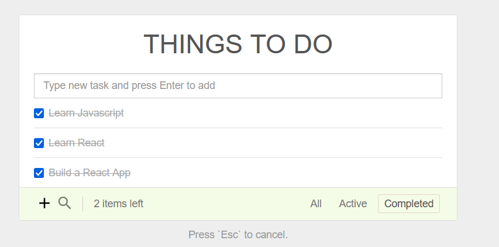

## React Todo App

This is a simple todo app built with React.

### Demo





## Instructions

First clone this repository.
```bash
$ git clone https://github.com/rbsinh/React-todo-app.git
```

Install dependencies. Make sure you already have [`nodejs`](https://nodejs.org/en/) & [`npm`](https://www.npmjs.com/) installed in your system.
```bash
$ npm install # or yarn
```

Run it
```bash
$ npm start # or yarn start
```
